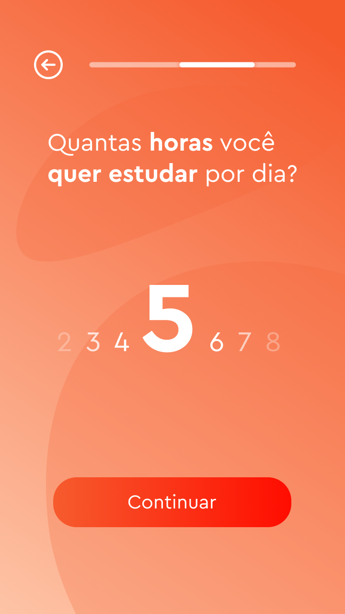

Pomo 
--

Pomo é um aplicativo mobile desenvolvido em Flutter, criado em colaboração com outros desenvolvedores durante o hackathon da Semana Acadêmica do curso de Ciências da Computação da Universidade Federal de Santa Catarina. Na competição, o desafio era criar um aplicativo útil para o dia a dia. Inspirado no método Pomodoro, o Pomo foi projetado para auxiliar na organização dos estudos.

O aplicativo permite que o usuário crie uma conta e cadastre disciplinas, configurando o tempo semanal desejado para cada uma e sua prioridade. Com essas informações, o software gera intervalos ideais de estudo e descanso específicos para cada disciplina. O Pomo também conta com uma API própria que gerencia dados de forma segura, utilizando bibliotecas que asseguram o gerenciamento dos dados.

Abaixo, você pode visualizar algumas das telas desenvolvidas:

 

  
  

 
 

  
  

 
 